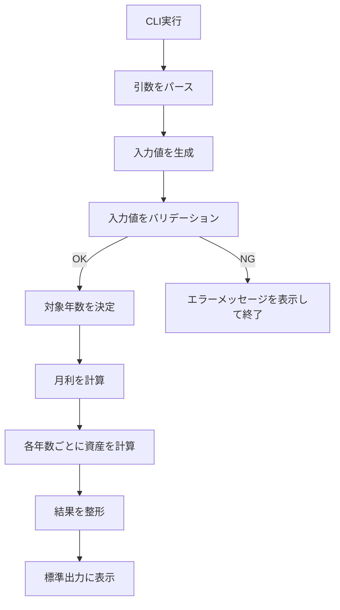
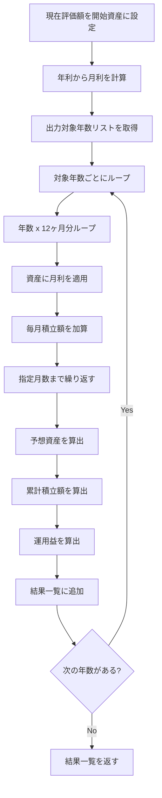

# 将来資産シミュレータ MVP 要件定義書

## 1. 目的

Go製CLIとして、現在の資産状況・毎月積立額・想定利回りを入力し、将来の資産推移を簡易的にシミュレーションできるツールを作成する。

MVPでは、投資判断の正確な助言ではなく、**ざっくりとした将来資産の見通しを得ること**を目的とする。

## 2. 対象ユーザー

主な対象は、自分自身、または個人で積立投資・貯蓄の将来推移を確認したいユーザー。

想定利用シーンは以下。

```txt
- 現在の資産から、将来どれくらい増えるか確認したい
- 毎月積立額を変えた場合の差を見たい
- 年利回りを複数パターンで試したい
- 将来的にWeb/API化する前提で、まずCLIで計算ロジックを作りたい
```

## 3. MVPのスコープ

MVPでやること。

```txt
- コマンドライン引数から入力値を受け取る
- 毎月複利で将来資産を計算する
- 1, 3, 5, 10, 20, 30, 40年後の結果を出力する
- 予想資産、累計積立額、運用益を表示する
```

MVPでやらないこと。

```txt
- 税金計算
- NISA枠の考慮
- 信託報酬・手数料の考慮
- インフレ率の考慮
- ボーナス積立
- 複数シナリオ比較
- Web UI
- APIサーバー化
- データ永続化
```

ただし、将来的に上記を追加しやすいよう、計算ロジックはCLI入出力から分離する。

---

## 4. 入力要件

### 4.1 必須入力

MVPでは以下を必須とする。

| 項目       | 説明                         |        例 |
| ---------- | ---------------------------- | --------: |
| 現在評価額 | 現時点で運用されている資産額 | 1,000,000 |
| 毎月積立額 | 今後毎月追加で積み立てる金額 |    50,000 |
| 年利回り   | 年間の想定利回り。%で入力    |         5 |

CLI引数イメージ。

```bash
asset-sim \
  --current-value 1000000 \
  --monthly 50000 \
  --annual-rate 5
```

### 4.2 任意入力

MVPでは任意入力として以下を検討する。

| 項目               | 説明                     | MVPでの扱い     |
| ------------------ | ------------------------ | --------------- |
| 元本               | 現在までに投資した金額   | 入れてもよい    |
| 現在の利益         | 現在評価額に含まれる利益 | 入れてもよい    |
| 何年間積み立てたか | 過去の積立期間           | MVPでは不要寄り |

ここは少し設計判断が必要です。

現在評価額を直接入力する場合、

```txt
現在評価額 = そのまま将来計算の開始値
```

元本と利益を分ける場合、

```txt
現在評価額 = 元本 + 現在の利益
```

となります。

MVPとしては、入力をシンプルにするなら **`current-value` を必須** にするのがよいです。
一方で、「元本」「利益」を入力させたいなら、`principal` と `profit` から `current-value` を計算する形になります。

この部分は後で決める論点にしたいです。

---

## 5. 出力要件

### 5.1 出力対象年数

MVPでは以下の年数を固定で出力する。

```txt
1年後
3年後
5年後
10年後
20年後
30年後
40年後
```

### 5.2 出力項目

各年数ごとに以下を表示する。

| 項目       | 説明                        |
| ---------- | --------------------------- |
| 年数       | 何年後か                    |
| 予想資産   | 複利計算後の資産額          |
| 累計積立額 | 現在評価額 + 将来の積立総額 |
| 運用益     | 予想資産 - 累計積立額       |

出力イメージ。

```txt
Years | Estimated Asset | Total Contribution | Gain
1     | ¥1,664,120       | ¥1,600,000          | ¥64,120
3     | ¥2,974,893       | ¥2,800,000          | ¥174,893
5     | ¥4,422,349       | ¥4,000,000          | ¥422,349
10    | ¥8,922,545       | ¥7,000,000          | ¥1,922,545
20    | ¥21,682,501      | ¥13,000,000         | ¥8,682,501
30    | ¥42,045,996      | ¥19,000,000         | ¥23,045,996
40    | ¥74,568,890      | ¥25,000,000         | ¥49,568,890
```

---

## 6. 計算要件

### 6.1 利回り

年利回りを月利に変換して、毎月複利で計算する。

```txt
月利 = (1 + 年利 / 100) ^ (1 / 12) - 1
```

例。

```txt
年利 5%
月利 = (1 + 0.05) ^ (1 / 12) - 1
```

### 6.2 毎月の資産計算

毎月以下の順で計算する。

```txt
資産 = 資産 * (1 + 月利)
資産 = 資産 + 毎月積立額
```

つまり、月初または月末どちらで積み立てるかという厳密な扱いはMVPでは深掘りしない。
ただし、将来的には以下を追加できる余地を残す。

```txt
- 月初積立
- 月末積立
- 年初一括投資
- ボーナス月追加投資
```

MVPでは仮に **「運用後に積立」** とする。

---

## 7. バリデーション要件

最低限、以下の入力チェックを行う。

| 項目       | ルール          |
| ---------- | --------------- |
| 現在評価額 | 0以上           |
| 毎月積立額 | 0以上           |
| 年利回り   | -100%より大きい |
| 出力年数   | 1以上           |

年利回りについては、マイナス利回りも許容する。

例。

```txt
--annual-rate -3
```

これは、下落シナリオも見たい場合に有用。

ただし `-100` 以下は資産が計算上破綻するためエラーにする。

---

## 8. 非機能要件

### 8.1 拡張性

将来的にAPI化しやすいよう、以下を分離する。

```txt
- CLIから入力を受け取る処理
- 入力値を検証する処理
- シミュレーション計算処理
- 出力を整形する処理
```

特に重要なのは、**計算ロジックがCLIに依存しないこと**。

避けたい設計。

```go
func main() {
    // flagを読む
    // その場で計算する
    // その場でfmt.Printlnする
}
```

目指したい方向性。

```txt
CLI
 ↓
Input Parser
 ↓
Validator
 ↓
Simulation Usecase / Service
 ↓
Result Formatter
 ↓
Console Output
```

### 8.2 テスト容易性

MVPでも、計算ロジックはユニットテスト可能にする。

テスト対象にしたいもの。

```txt
- 月利変換
- 指定年数後の資産計算
- 累計積立額の計算
- 運用益の計算
- 不正な入力値のバリデーション
```

### 8.3 API化への備え

将来的にAPI化する場合でも、以下のように差し替えられる構成を目指す。

```txt
CLI Input
  ↓
Simulation Usecase
  ↓
CLI Output
```

将来。

```txt
HTTP Request
  ↓
Simulation Usecase
  ↓
HTTP Response
```

つまり、CLIもAPIも同じ計算処理を使う。

---

## 9. 処理フロー

### 9.1 全体フロー



### 9.2 シミュレーション計算フロー



---

## 10. 将来拡張の候補

MVP後の機能追加候補。

### 10.1 入力拡張

```txt
- 元本 + 現在利益から現在評価額を算出
- 積立期間を入力
- ボーナス月の追加積立
- 年1回の一括投資
- 積立終了年齢
- 取り崩し開始年齢
- インフレ率
- 税率
- 信託報酬
```

### 10.2 出力拡張

```txt
- CSV出力
- JSON出力
- Markdown表出力
- 年次ごとの全データ出力
- 月次ごとの全データ出力
- 複数シナリオ比較
```

### 10.3 API化

将来的には以下のようなAPIにできる。

```http
POST /simulations
```

リクエスト例。

```json
{
  "currentValue": 1000000,
  "monthlyAmount": 50000,
  "annualRate": 5,
  "targetYears": [1, 3, 5, 10, 20, 30, 40]
}
```

レスポンス例。

```json
{
  "results": [
    {
      "years": 1,
      "estimatedAsset": 1664120,
      "totalContribution": 1600000,
      "gain": 64120
    }
  ]
}
```

---

## 11. 設計上、まだ決めない論点

ここは勝手に決めず、壁打ちで詰めたいところです。

### 論点1: 入力は「現在評価額」か「元本 + 利益」か

案A。

```txt
current-value を必須にする
```

メリット。

```txt
- CLI入力がシンプル
- 将来計算に必要な値が明確
- API化しても扱いやすい
```

デメリット。

```txt
- 元本と利益を分けた表示がしづらい
```

案B。

```txt
principal と profit を入力させる
```

メリット。

```txt
- 元本・運用益の分解がしやすい
- 現在利益を意識した表示にできる
```

デメリット。

```txt
- 入力が少し面倒
- `principal + profit` の扱いを説明する必要がある
```

個人的には、MVPは **案A: current-value必須** がよいです。
元本と利益は後から追加でよいと思います。

### 論点2: 毎月積立は月初か月末か

案A。

```txt
月利適用後に積立する
```

案B。

```txt
積立後に月利を適用する
```

MVPではどちらかに固定でよいです。
ただし、結果が微妙に変わるため、ヘルプ表示には明記した方がよいです。

### 論点3: 金額をfloat64で扱うか、int64で扱うか

案A。

```go
float64
```

メリット。

```txt
- 計算が簡単
- MVP向き
```

デメリット。

```txt
- 小数誤差が出る
```

案B。

```go
int64
```

メリット。

```txt
- 円単位で安全
- 出力が安定する
```

デメリット。

```txt
- 利回り計算では結局小数が必要
- 丸め方を決める必要がある
```

MVPでは、内部計算は `float64`、出力時に円単位へ丸めるくらいでよいと思います。
ただし、将来的に税金や手数料を入れるなら、丸めルールは早めに決めたいです。

### 論点4: CLIの責務をどこまで薄くするか

API化を見据えるなら、CLIは以下だけにしたいです。

```txt
- 引数を読む
- usecaseに渡す
- 結果を表示する
```

計算処理はCLIに置かない。

これは最初から意識した方がよいです。

---

## 12. MVP時点の暫定仕様

いったんの暫定仕様としてはこれが良さそうです。

```txt
入力:
- current-value: 現在評価額
- monthly: 毎月積立額
- annual-rate: 年利回り

出力:
- 1, 3, 5, 10, 20, 30, 40年後
- 予想資産
- 累計積立額
- 運用益

計算:
- 年利を月利に変換
- 月ごとに複利計算
- 月利適用後に毎月積立額を加算

設計:
- CLI入出力と計算ロジックを分離
- 将来API化しても同じ計算処理を再利用できる形にする
```

次に決めるべきは、まず **入力を `current-value` 必須にするか、`principal + profit` にするか** だと思います。
